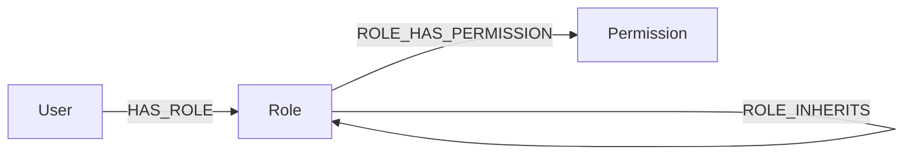

# ReBAC на Neo4j (Python)

Простейшая система **Relation-based Access Control (ReBAC)** поверх графовой СУБД **Neo4j**, с REST API для управления **пользователями**, **ролями**, **правами** и их **связями** (включая наследование ролей, параметры назначений и объяснение решений).

## Цели

* Реализовать базовые CRUD-операции для `User`, `Role`, `Permission`.
* Создать связи:
  * `Role` ↔ `Permission` с наследованием ролей.
  * `User` ↔ `Role` с параметрами на ребре (`scope`).
* Реализовать проверку наличия роли/права у пользователя и **объяснение решения** (decision path).
* Без аутентификации и авторизации самого API (чистый CRUD).

## Архитектура и стек

* Язык: **Python 3.13**.
* Веб-фреймворк: **FastAPI**.
* БД: **Neo4j 5** (Bolt + HTTP).

## Быстрый старт

```bash
# 1) Клонирование
git clone https://github.com/akayumeru/graph-based-rebac.git
cd graph-based-rebac

# 2) Запуск в Docker
docker compose up --build -d

# 3) Проверка готовности
curl -s http://localhost:8000/health
```

## Схема данных (граф)



* Узлы:
  * `User{user_id: string, name?: string}`
  * `Role{role_id: string, key: string}`
  * `Permission{perm_id: string, key: string}`
* Рёбра:

  * `(:Role)-[:ROLE_HAS_PERMISSION]->(:Permission)`
  * `(:Role)-[:ROLE_INHERITS]->(:Role)` (наследование)
  * `(:User)-[:HAS_ROLE {scope}]->(:Role)`

## Инициализация индексов и ограничений (DDL)

```cypher
// Роли
CREATE CONSTRAINT role_key IF NOT EXISTS
FOR (r:Role) REQUIRE r.key IS UNIQUE;

// Права
CREATE CONSTRAINT perm_key IF NOT EXISTS
FOR (p:Permission) REQUIRE p.key IS UNIQUE;

// Пользователи
CREATE CONSTRAINT user_id IF NOT EXISTS
FOR (u:User) REQUIRE u.user_id IS UNIQUE;
```

## Спецификация API

Базовый URL: `http://localhost:8000`

* **Health**
  * `GET /health`

* **Permission**
  * `POST /permissions`
  * `GET /permissions?key=...`
  * `GET /permissions/{perm_id}`
  * `DELETE /permissions/{perm_id}`

* **Role**
  * `POST /roles`
  * `GET /roles?key=...`
  * `GET /roles/{role_id}`
  * `DELETE /roles/{role_id}`
  * `POST /roles/{role_id}/permissions` — привязка права к роли
  * `DELETE /roles/{role_id}/permissions/{perm_id}`
  * `POST /roles/{child_id}/parents` — наследование ролей
  * `DELETE /roles/{child_id}/parents/{parent_id}`
  * `GET /roles/{role_id}/permissions?mode=direct|effective`

* **User**
  * `POST /users`
  * `GET /users?user_id=...`
  * `GET /users/{user_id}`
  * `DELETE /users/{user_id}`
  * `POST /users/{user_id}/roles` — назначение роли с параметрами
  * `DELETE /users/{user_id}/roles/{role_id}`
  * `GET /users/{user_id}/roles?mode=direct|effective&scope=`

* **Проверки и объяснения**
  * `GET /users/{user_id}/has-role/{role_key}?scope=&aggregate=`
  * `GET /users/{user_id}/has-permission/{perm_key}?scope=`
  * `GET /users/{user_id}/decision/role/{role_key}?scope=&limit_paths=&max_depth=`
  * `GET /users/{user_id}/decision/permission/{perm_key}?scope=&limit_paths=&max_depth=`
